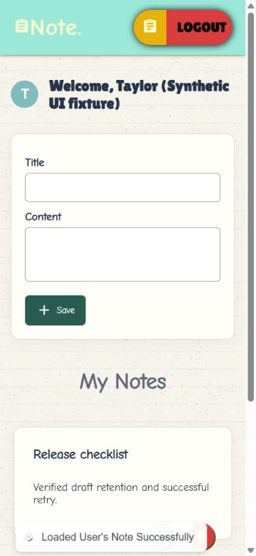

# Notes — frontend

Shivansh Verma's notes application, paired with NotepadAppBackend. The upgrade/notes-v1 branch is modernizing the original React 18/Create React App/MUI product incrementally. First slice improves reliable capture/edit: failed saves retain drafts, duplicate submissions are blocked, labels/pending/errors are accessible, deletion asks for confirmation, stable note IDs preserve component identity and the workspace fits mobile/desktop. This is an upgrade branch, not a verified hosted release.

## Setup and checks
Node 22+, npm ci, npm start. The current source targets http://localhost:4040/notepad with credentials; run the paired backend. Its legacy cookie configuration must be fixed before real local/cross-host auth works. Do not copy production credentials into frontend source.

npm test -- --watchAll=false --runInBand; npm run lint (changed save components/tests); npm run build. Four component tests and the production build passed. Existing CRA/Babel/Browserslist deprecation warnings remain; see docs/VERIFICATION.md for precise scope. Plain JavaScript has no typecheck command. The production build is in build/ and needs SPA fallback hosting plus a correctly configured API before deployment.

## Product release and AI
The durable release criteria in BACKLOG.md cover correct private CRUD, a polished searchable notes workspace and one opt-in summary over authorized selected notes. AI is planned, not implemented or mocked as a live feature. Provider keys will stay server-side. No user counts, performance gains, live URL or hiring-impact metrics are claimed.

## Continuity and recovery
UPGRADE_LOG.md and docs/DECISIONS.md record changes/next tasks. Keep the original default branch recoverable; do not deploy over its existing site or migrate data without authorization. The paired backend docs/automation contains the recurring workflow's runner source. Screenshots capture synthetic local UI verification. The actual database and hosted journey are pending.

